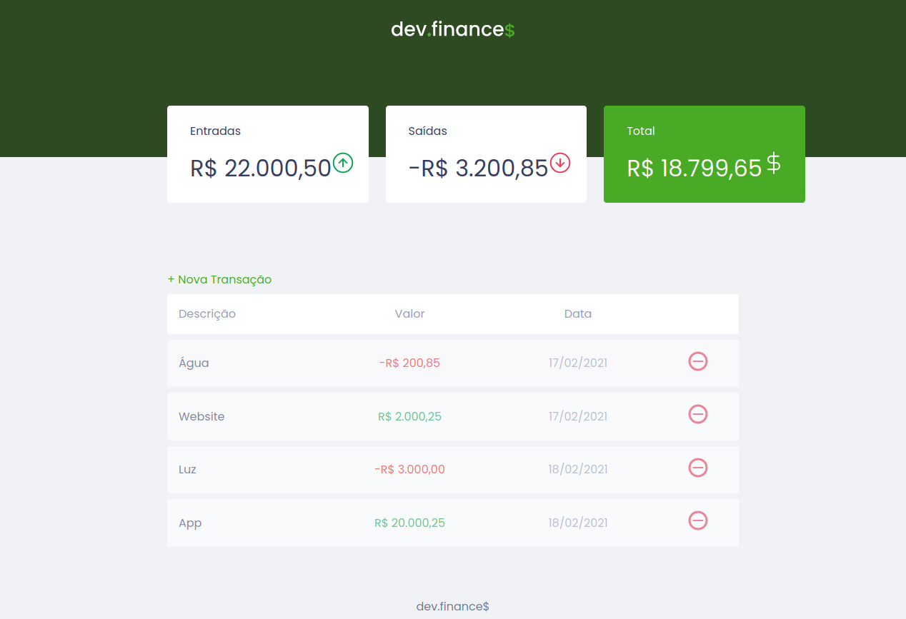
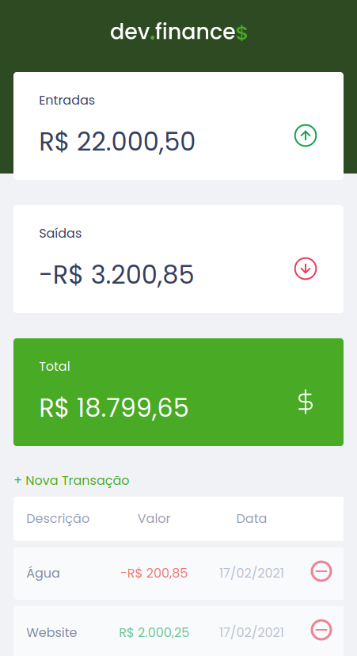

Projeto de finanças da Maratona Discover da <a href='https://github.com/rocketseat-education' target="_blank">Rocketseat</a> feito em JavaScript puro

  

  

<h2>Tecnologies:</h2>
<ul>
  <li>JavaScript</li>
  <li>HTML</li>
  <li>CSS</li>
  <li>LocalStorage</li>
</ul>
